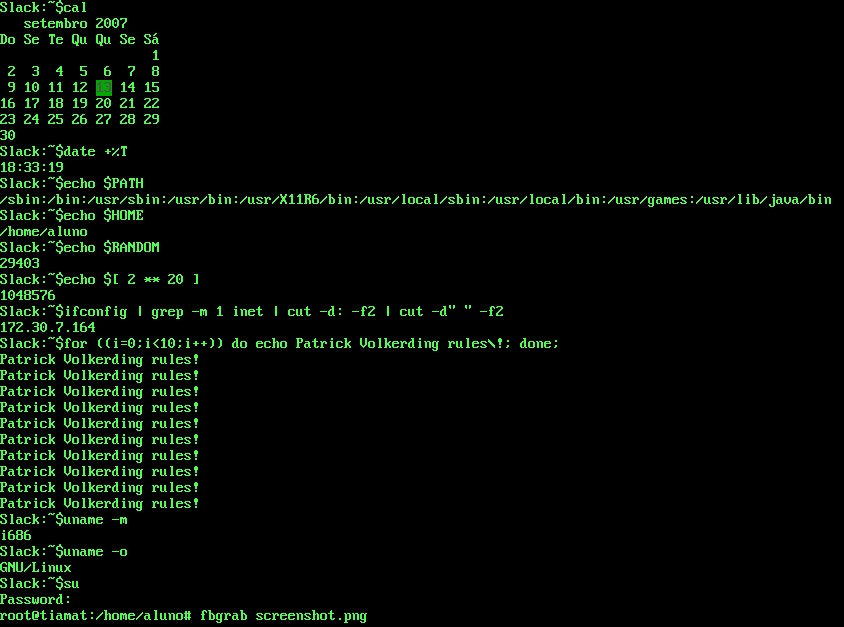

    
    

If you've been using a graphical user interface for most of the time you've
spent on the computer, you probably have wondered if there's a way to be more
productive and efficient on the computer. Face it, moving the mouse cursor and
navigating by clicking on folders again and again can be time-consuming!

Luckily, there's a whole new type of digital environment out there. It's where
you constantly type on the keyboard to get things done. And it's **much faster**
to perform repetitive tasks, files management, etc. if you work in such an
environment. Look no further, we've been talking about **the command line**.

Behind all the text that appears, there's a program working under the hood. Its
task is to interpret what you've typed. This program is usually **a Shell
interpreter** when it comes to macOS or GNU/Linux. **Bash** is the Shell
interpreter commonly used in those two families of operating systems.

So, we present to you, a basic Bash guide. Learning Bash means learning the
commands that Bash actually understands. The guide is intended for beginners
and will go from the most simple commands to more advanced ones. For each
command, we will also introduce its helpful options. The guide is intended for
GNU/Linux users (especially those that are fairly new to GNU/Linux systems).
macOS users can take this guide as well, since today's macOS systems come with
Bash too.

At a ground surface, this might just look like another Bash guide on GitHub.
However, unlike other Bash guides on GitHub, this one is more oriented towards
beginners, and focus on making good use of commands instead of just learning
a bunch of commands. The guide also contains explanations on some concepts
that are required for GNU/Linux command line users to know before learning the
commands. If you've already learned the concepts and just want a reference, see
[42tm's Bash Reference](http://github.com/42tm/bash-ref).

Although the information contained within the guide was carefully reviewed
before publishing, mistakes are inevitable. We welcome and much appreciate any
contribution. The preferred way to do so is by opening a pull request on GitHub.
You can also suggest new ideas by opening a new issue on GitHub.

Thank you, and we hope you enjoy reading the guide and learning Bash all along.

Sincerely, 
42tm Team

