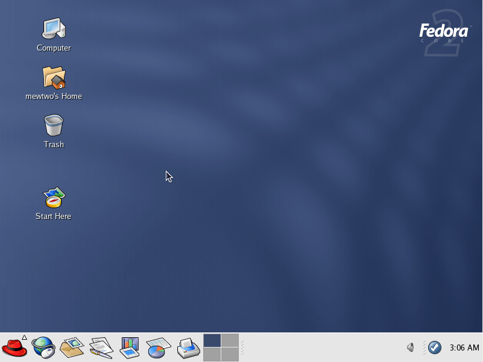

    
    

    <b><a style="text-decoration: none"
          href="#chapter-summary">Chapter Summary</a></b>
    &mdash;
    <b><a style="text-decoration: none"
          href="#chapter-quiz">Chapter Quiz</a></b>

**New concepts**:  

<!-- Define link aliases (if any) here -->

- - -

<!-- This is where you introduce what the chapter is about. -->
If you're new to Bash in specific and the command line in general, **welcome!**.
In this very first chapter of the Bash Tutorial, you'll get to know about the
command line environment, Shell, differences between Shell interpreters,
terminal emulator's shortcuts, and more. Let's begin!

Table of Content
----------------

Command line user interface
---------------------------

The majority of computer users make use of **graphical user interfaces**
(abbreviated **_GUI_** or **_GUIs_** for plural) to control their machines. That
is, they navigate and control their computers by clicking/sliding icons,
buttons, sliders, etc. with a mouse pointer. Of course, they do use the
keyboard, but not all of the time. The screenshot below shows a graphical user
interface that came with Fedora Core 2 - an old release of the Fedora operating
system that was first released in 2004.

**Figure 0.1** A screenshot of Fedora Core 2. The presence of graphical icons
and a mouse pointer tells us that this is indeed a GUI.

In a graphical user interface, the visual design (i.e. UI/UX design) takes a
very important role in the user's interpretation and experience. One example of
the effect that the design has on the user's interpretation is, if a button on a
web page that links to the site's Search page contains an icon that illustrates
a house, the user will think that the button will lead to the site's homepage.
Visual design is the key in GUIs.

The graphical user interface is sufficient for average computer users. However,
those who seek for more productivity and efficiency on the computer should know
how to use a **command line interface** (abbreviated **_CLI_**).

A command line interface is where you control your computer by typing commands
to tell the computer what you want to do.

Chapter Summary
---------------

Chapter Quiz
------------
