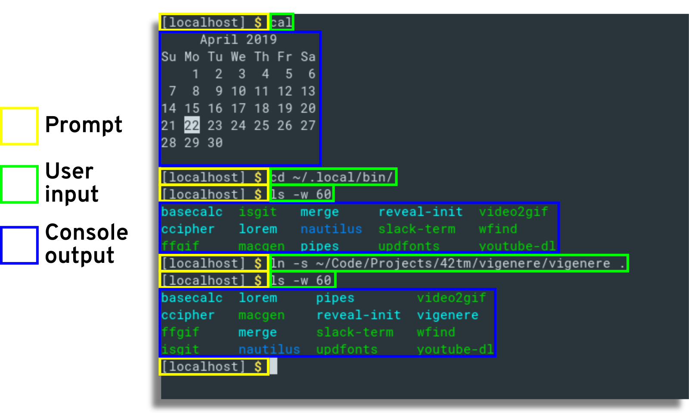
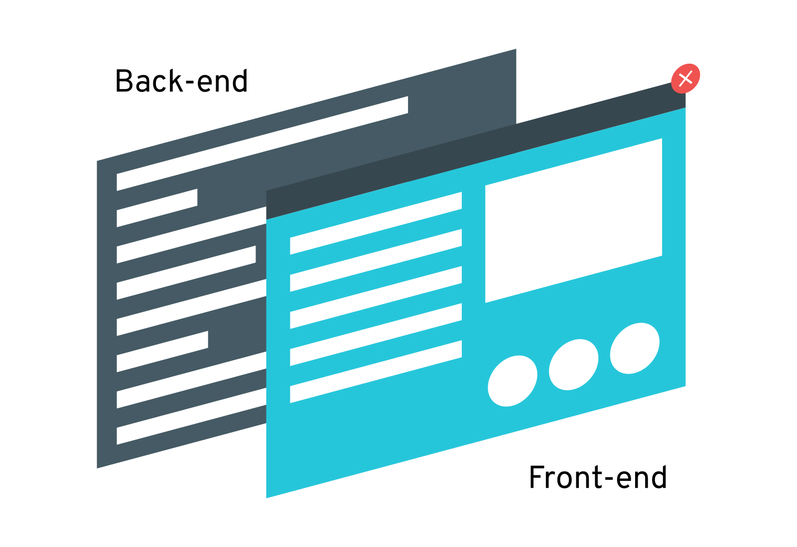
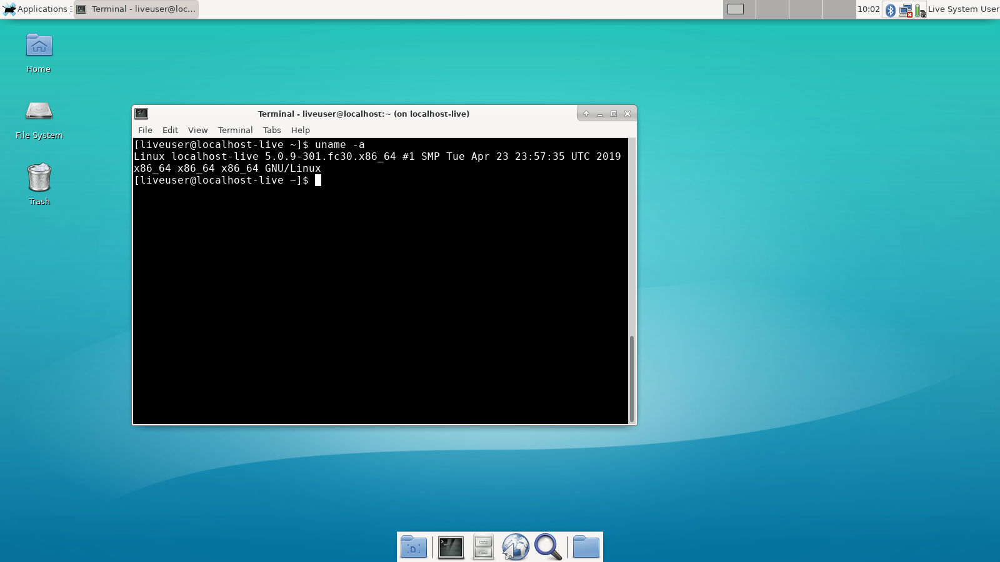

<p align="center">
    
    
</p>

<p align="center">
    <b><a style="text-decoration: none"
          href="#chapter-summary">Chapter Summary</a></b>
    &mdash;
    <b><a style="text-decoration: none"
          href="#chapter-quiz">Chapter Quiz</a></b>
</p>

**New concepts**: [graphical user interface](#term-gui), [command line
interface](#term-cli), [prompt](#term-prompt), [user input](#term-user_input),
[console output](#term-console_output).

<!-- Define link aliases (if any) here -->

- - -

<!-- This is where you introduce what the chapter is about. -->
If you're new to Bash in specific and the command line in general, **welcome!**
In this very first chapter of the Bash Tutorial, you'll get to know about the
command line environment, Shell, differences between Shell interpreters,
terminal emulator's shortcuts, and more. Let's begin!

> **Note**: <!-- Note about skipping content here -->

Table of Content
----------------

1. [Command line user interface](#command-line-user-interface)
2. [Command line efficiency](#command-line-efficiency)
    1. [Control and Speed](#control-and-speed)
    2. [System resources](#system-resources)
    3. [GUI's advantages over CLI](#guis-advantages-over-cli)
3. [Who use the command line interface?](#who-use-the-command-line-interface)

Command line user interface
---------------------------

Most computer users make use of <a name="term-gui">**graphical user interfaces**
</a>(abbreviated **_GUI_** or **_GUIs_** for plural) to control their machines.
That is, they control their computers by clicking/sliding icons, buttons,
sliders, etc. with mouse pointers. Of course, they do use keyboards, but not all
of the time. The screenshot below shows a graphical user interface that came
with Fedora Core 2 - an old release of the Fedora operating system that was
first released in 2004.

 <br />
**Figure 0.1** A screenshot of Fedora Core 2. This is a GUI because there are
graphical icons and a graphical mouse pointer.


In a graphical user interface, the visual design (i.e. UI/UX design) takes a
very important role in how the user understands and experiences. For example, if
a button on a web page that links to the site's Search page contains an icon of
a house (like the one on the left), the user will think that the button will
lead to the site's homepage. Visual design is the key in GUIs.

GUI is suitable and enough for average computer users. However, if you want to be more productive and efficient on the computer, you should know how to use a
<a name="term-cli">command line interface</a> (abbreviated **_CLI_**).

A command line interface is where the user controls a computer mainly by typing
commands. Typically, in a command line session, the user types a command to draw
an action, then waits for the action to be done, and then types the next
command. In general, a command line session has 3 distinctive components: the
<a name="term-prompt">**prompt**</a>, the <a name="term-user_input">**user
input**</a>, and the <a name="term-console_output">**console output**</a>. They
are shown in **Figure 0.2**.

  
**Figure 0.2** 3 distinct types of components in a command line session.

- The **prompt** is a piece of text that appears when the computer is ready for
the next command. It basically says that the user can now type the next command.
- The **user input** is a command in the form of text typed in by the user to
specify what the user wants to do.
- The **console output** is a visible chunk of text that is produced while the
command is running. The text can be log messages (such as warning messages or
error messages) or the result the user expected to see. For example, take a look
at **Figure 0.2** again. The first command typed by the user is `cal`. It is a
command used to see a calendar printed in the format typically used in printed
calendars. Indeed, the console output produced by `cal` showed a calendar with
the current date highlighted.

As said earlier, commands are successively executed in a command line interface.
That means, after typing a command, the user will have to wait for that command
to finish running before he/she can issue the next command<sup><a
href="#footnote-1">[1]</a></sup>. To better understand what that means, see
**Figure 0.3**.

  
**Figure 0.3** A command line session. Here, it can be clearly seen that
command inputs are successive.

<a name="footnote-1"></a>
> **[1]**: Strictly speaking, this is not true for most CLIs that go with macOS
or GNU/Linux machines, because these are operating systems that can multi-task
(carry multiple tasks at the same time). You can technically start a process,
let it run in the background, and continue executing other commands without
waiting for the process started earlier to finish. There are also "terminal
multiplexers" which can give you a better image of different running processes.
But for now, let's not worry about those at the moment, and assume that CLIs
don't offer the ability to multitask like they traditionally did.

Command line efficiency
-----------------------

To be the most efficient on the computer, you need to use both the CLI and the
GUI reasonably. Some tasks are more quickly done in the CLI and some are more
quickly done in the GUI. Some are possible in the command line but not in the
GUI and vice versa.

### Control and Speed

The command line gives you more control than a GUI. Programs used in the command
line are often versatile and (as a result) complex, but since they don't get
displayed as graphical windows, the complexity is just hidden.

Imagine a universal file-finding program with many options (such as finding
executable files, finding files that are recently edited, finding files whose
names match a particular pattern, etc.). If such a program is available in the
command line, the computer user will have to spend time through a (possibly)
intimidating process of learning the program's options, but once that is done, the
user will just have to type the options needed every time he/she wants to use the
program. But if that program is available as a graphical application, either all
the options get visually displayed or they get grouped and hide into tool bars
and menus. Navigating through these is definitely more time-consuming.

In addition, there are low-level tools to work with your operating system and
they are only available in the command line. In fact, CLI is the predecessor of
GUI. CLI came first, and then there came GUI. Nowadays, many graphical programs
actually rely on text commands under the hood. A button on such a program is
tied to a specific command to carry out the intended instructions.

  
**Figure 0.4** GUI can be seen as the pretty layer on top of CLI. The graphical
interface that the users see is usually referred to as the "front-end", and the
underlying system is usually referred to as the "back-end".

The command line also introduces ways to repeat a task again and again that
would be otherwise impossible in a graphical environment.

### System resources

Using a GUI consumes more system resources than using a CLI. This is obvious,
since a graphical environment requires loading images, icons, fonts, videos and
other graphical components, which are heavier and more complex than just plain
text. No wonder why many graphical applications take a long time to load. In a
command line interface, lagging is something perhaps unbeknownst to many.

### GUI's advantages over CLI

Some tasks are more quickly done in the GUI. A graphical button may be tied with
multiple commands. Clicking such a button gets the work done faster than
manually typing the commands. For example, if you want to safely eject a USB
device from your computer, you will only have to click one button<sup><a
href="#footnote-2">[2]</a></sup>. But if you want to eject it by typing
commands, 3 commands (or even more) will have to be issued:

```shell
lsblk                # Find the mount point of the mounted partition in the USB device
umount /dev/sdb1     # Un-mount the partition
sudo eject /dev/sdb  # Eject the USB device, requires typing user password
```

> **Note**: Please do not worry about learning the commands above at the moment.

There are also tasks that are possible in the GUI but not in the CLI, such as
image editing or video editing<sup><a href="#footnote-3">[3]</a></sup>.

<a name="footnote-2"></a>
> **[2]**: At least that's true if you are using the GNOME desktop environment.

<a name="footnote-3"></a>
> **[3]**: Strictly speaking, that's possible but not to a great extent. Not
even to a _good_ extent. It's obvious that no image editor uses the CLI for much
of their work.

Who use the command line interface?
-----------------------------------

- **Computer programmers**: They develop applications and need to sort out their
ideas in a command line environment first before putting a pretty layer - the
graphical interface - on top. Programmers also use lots of command line programs
for speed and productivity.
- **Back-end developers**: They work on the inner-working components, not the
outer layer that is intended to be visually nice, so they work in CLI a lot.
- **Website/Server maintainers**: Website and server maintenance is done much
faster in the CLI.
- **Computer scientists**: When they want to test their new ideas such as
algorithms or ways to optimize an operating system, text commands are usually
their preferred way.
- **Supercomputer operators**: GUI is not featured in supercomputers in order
for these behemoths to work to their fullest extends. Managing a supercomputer
is also more quickly done in CLI.
- **Retro computing hobbyists**: Retro computers (i.e. old computers, made in
the 20<sup>th</sup> century) don't have GUI.
- **A small portion of non-technicians**: They just want to play around with the
text commands or get things done quickly.
- ~~Gormless kids who try to look like hackers~~
- ...and more

How do I access a command line interface on my (graphical) system?
------------------------------------------------------------------

On any graphical system that is either GNU/Linux or macOS, there should be a
program that ships with the system that lets its users use a command line. This
program is called "terminal emulator". The reason why it is called an "emulator"
is because the interface introduced by such a program is not actually CLI; you
can change its font, its background color, etc. yet these attributes are tied to
GUI (see **Figure 0.5**).

  
**Figure 0.5** 2 terminal emulator windows opened, each with a different look.

Terminal emulators come in handy and useful, providing that you need both GUI
and CLI to maximize your productivity. In this section, we provide instructions
on how to open a terminal emulator in GNU/Linux and also in macOS.

### On GNU/Linux

If you use GNU/Linux, the terminal emulator ships with your desktop environment.
For instance, if you're using GNOME - the most widely used Linux desktop
environment - then a terminal emulator called "GNOME Terminal" (as seen in
**Figure 0.6**) should have already been provided as a software component of
GNOME, and you can search for it like how you search other applications on your
computer.

  
**Figure 0.6** A GNOME Terminal window, as seen in the GNOME desktop
environment.

In KDE (another desktop environment), the terminal emulator Konsole is provided
as part of the desktop environment itself. In LXDE, the terminal emulator is
called "LXTerminal".

In Ubuntu (arguably the most popular Linux distribution), you can use the
keyboard shortcut `Ctrl` + `Alt` + `T` to open a terminal emulator.

  
**Figure 0.7** An XFCE4 Terminal window, as seen in the XFCE desktop
environment.

Perhaps in any desktop environment, you can just search for "terminal".

### On macOS

The terminal emulator that ships with macOS is called "Terminal". Try searching
for it and open it.

<p align="center">
    
</p>

**Figure 0.8** A macOS Terminal window.

Chapter Summary
---------------

Chapter Quiz
------------
