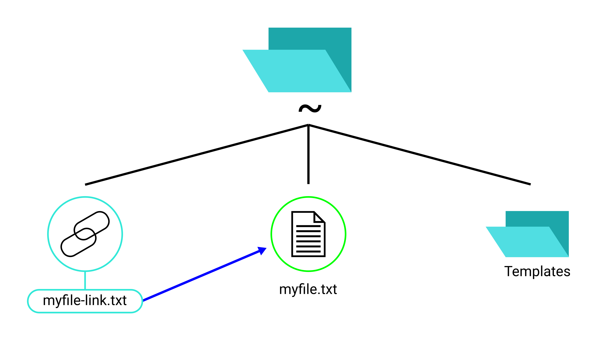
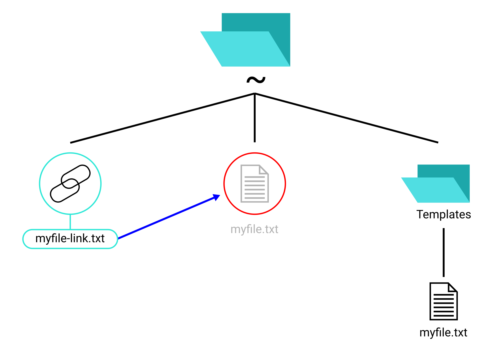
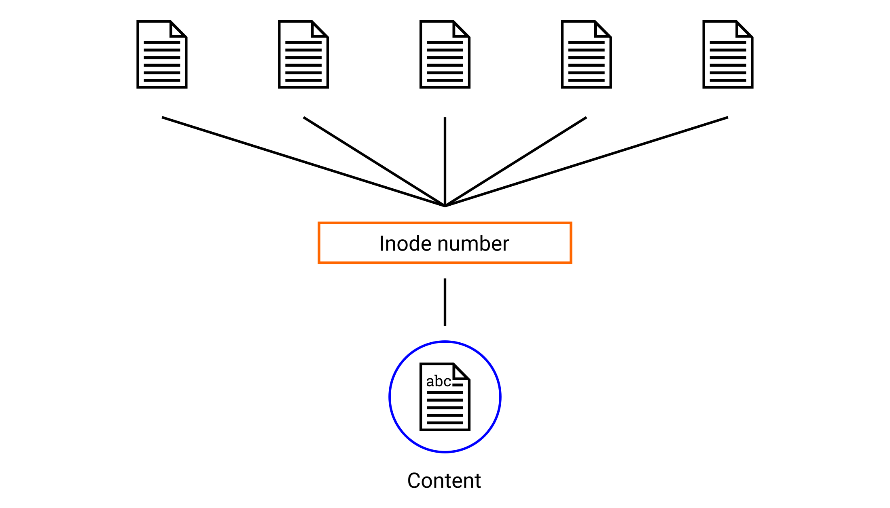

<h3 align="center">Chapter 3</h3>
<h1 align="center">More operations with files</h1>

<p align="center">
    <b><a style="text-decoration: none"
          href="#chapter-summary">Chapter Summary</a></b>
    &mdash;
    <b><a style="text-decoration: none"
          href="#chapter-summary-commands">Commands Summary</a></b>
    &mdash;
    <b><a style="text-decoration: none"
          href="#chapter-quiz">Chapter Quiz</a></b>
</p>

**New commands**:  
**Commands extended**:  
**New concepts**:  

<!-- Define link aliases (if any) here -->

- - -

In the prior chapter, you've learned several commands for file operations. In
this chapter, you will be learning even more useful things, such as links, patch
files, file compression, and how to find files.

Table of Content
----------------

Symbolic links and hard links
-----------------------------
###### Tags: `#new-concept`, `#new-command`, `#extend`

Suppose you want to have 2 files that have the same exact content. What would
you do? Copy and paste? Ummm...no. There are two downsides to copying:
1. Your hard disk drive is consumed more. This is especially true for large
files. If a file is 50MB in size, its copy will also be 50MB, and now both the
original file and the copy take up 100MB.
2. If the original file's content is changed, you have to update the copy.

This is where links come into play. Symbolic links and hard links are some of
the most useful things in GNU/Linux.

### Symbolic link
###### Tags: `#new-concept`, `#new-command`

A symbolic link (also called "symlink") is a pointer to another file. It refers
to the target file by a relative path between it and the target file. Whenever
you access a symbolic link, you are actually accessing the file that the link
refers to.

It's best to see what this means by doing an example. To create a symbolic link,
we use the `ln` (<b>l</b>i<b>n</b>k) command:

```
ln -s target-file-path link-name
```

...replacing "`target-file-path`" with path to the file that you want to create
a link of, and "`link-name`" with name of the link. The `ln` command, here,
should be used with the `-s` option (otherwise it will create a hard link,
which we'll go over next).

Do the following:
1. Create a text file called "`myfile.txt`" in your home directory.
2. Add some text content to `myfile.txt`.
3. Run `ln -s myfile.txt myfile-link.txt`. This will create a symbolic link of
`myfile.txt` called `myfile-link.txt`.
4. Run `cat myfile-link.txt`. `myfile.txt`'s content should be displayed.
5. Change `myfile.txt`'s content.
6. Run `cat myfile-link.txt` again. Is `myfile.txt`'s updated content displayed?

```
$ touch myfile.txt                     # Step 1
$ cat > myfile.txt                     # Step 2
Hello, World!
$ ln -s myfile.txt myfile-link.txt     # Step 3
$ cat myfile-link.txt                  # Step 4
Hello, World!
$ echo "Hello, student!" > myfile.txt  # Step 5: Changing myfile.txt's content
$ cat myfile-link.txt                  # Step 6
Hello, student!
```


**Figure 2.1** `myfile-link.txt` is a symbolic link that points to `myfile.txt`.

7. Run `stat myfile.txt` and `stat myfile-link.txt` and see the sizes (labeled
"`Size`"). Are the sizes different?

```
$ stat myfile.txt
  File: myfile.txt
  Size: 16        	Blocks: 8          IO Block: 4096   regular file
  ...
$ stat myfile-link.txt
  File: myfile-link.txt -> myfile.txt
  Size: 10        	Blocks: 0          IO Block: 4096   symbolic link
  ...
```

As you can see above, `myfile.txt`'s size is 16KB, while the link's size is
10KB. Even if `myfile.txt`'s content was larger, the link's size would still be
10KB. This is what makes symbolic links useful.

> **Note**: A large part of each of the `stat` command's output was replaced
with "...".

> **Note**: Remember that the link contains the _relative_ path between the link
and the file that the link refers to. In this case, the link (`myfile-link.txt`)
contains the path "myfile.txt". Each character is 1KB in size, the string
"myfile.txt" has 10 characters, thus the link is 10KB in size. If the relative
path was something different (i.e. longer or shorter), the link's size would be
different. Thus, not all symbolic links are 10KB in size.

8. Move `myfile.txt` to somewhere else (e.g. to `~/Templates`). Run
`cat myfile-link.txt`. What happens?

```
$ mv myfile.txt Templates/  # Moving myfile.txt from its original location
$ cat myfile-link.txt
cat: myfile-link.txt: No such file or directory
```

A symbolic link refers to a file via a relative path between the link and the
actual file. When you move `myfile.txt` to another location, the relative path
that `myfile-link.txt` has is not updated, thus the link is now referring to a
non-existent file.


**Figure 2.2** `myfile.txt` is moved into `~/Templates` but `myfile-link.txt` is
still pointing to `./myfile.txt` which is now non-existent. Such links that
point to non-existent destination are considered to be broken.

9. Now that you've completed this task, delete `myfile-link.txt` and
`myfile.txt`.

### Hard link
###### Tags: `#new-concept`, `#new-command`, `#extend`

A hard link is a file that has the same inode number as another file.
<a name="inode-def">Files that have the same inode number have the same content.
</a>When the content of one of those files is changed, the contents of other
files are changed, too. Deleting a file doesn't affect the other files.

To create a hard link, use `ln` without the `-s` option:

```
ln any-file-path link-name
```

The below Shell session demonstrates hard links.

```
$ cat > myfile.txt         # Create a new text file & add some content to it
A demonstration of links.
$ ln myfile.txt hlink.txt  # Create a hard link named "hlink.txt"
$ cat hlink.txt            # hlink.txt shares the same content with myfile.txt
A demonstration of links.
$ echo "A demonstration of hard links." > myfile.txt
$ cat hlink.txt
A demonstration of hard links.
$ echo "Second line to file." >> hlink.txt
$ cat myfile.txt
A demonstration of hard links.
Second line to file.
$ cat hlink.txt
A demonstration of hard links.
Second line to file.
$ mv hlink.txt Templates/  # Moving hlink.txt to somewhere else
$ cat myfile.txt
A demonstration of hard links.
Second line to file.
$ cat Templates/hlink.txt  # Location doesn't matter
A demonstration of hard links.
Second line to file.
```

To see the inode number of a file, use `ls -i`:

```
$ ls -i myfile.txt Templates/hlink.txt
16517901 myfile.txt  16517901 Templates/hlink.txt
```

In the example output above, both `myfile.txt` and `Templates/hlink.txt` have
16517901 as the inode number.

### Symbolic link vs. Hard link

So which one to choose? Symbolic link or hard link? It actually depends, because
each has its own advantages and disadvantages.

Hard links are great, because they use inode referencing: You can say that the
inode is the thing that actually holds the content, and any file linked to it
has that content, thus moving or deleting a file does not have any effect on the
other files.


**Figure 2.3** Files that share the same inode number have the same content. To
create a hard link is to create a file with the same inode number as another
file.

But hard links don't work across filesystems, because each filesystem has its
own way of handling inode numbering. Some filesystems don't even have inode
numbering at all, like FAT32. Symbolic links, on the other hand, may work across
filesystems, but symbolic links are inconsistent: If the target file is moved,
symbolic links pointing to it will all be broken.

Finding files
-------------

One of the most important tasks to do on a computer is finding files. Although
finding files can be made easy by carefully organizing them using folders, there
are still cases where file-finding commands come into play. For example, if you
have a lot of screenshot images that are named by the date taken, you can use
`find` to find files of the same month and delete them. Or if you mistakenly
move a file to somewhere while working with Bash and you don't know where the
file has gone, you can still find it using `locate`.

### `find`

### `locate`

### Using wildcards

Chapter Summary
---------------

Chapter Summary: Commands
-------------------------

Chapter Quiz
------------
