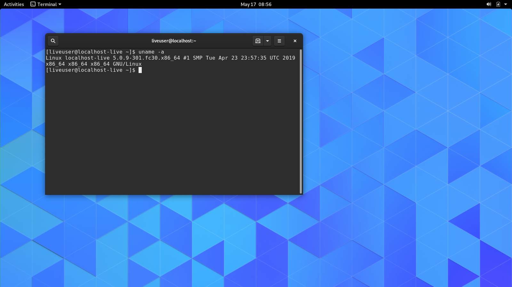
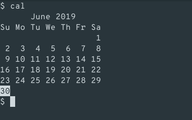
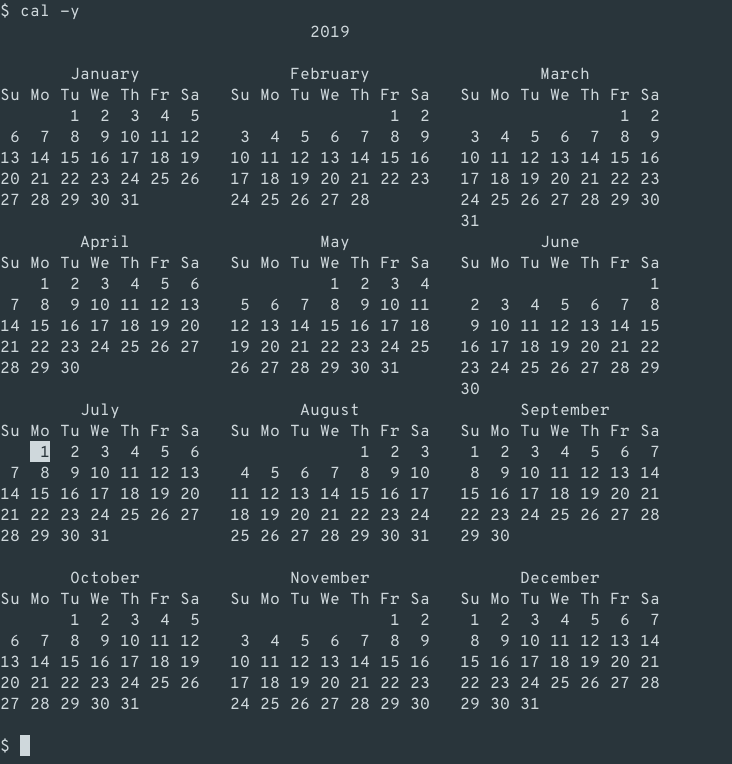
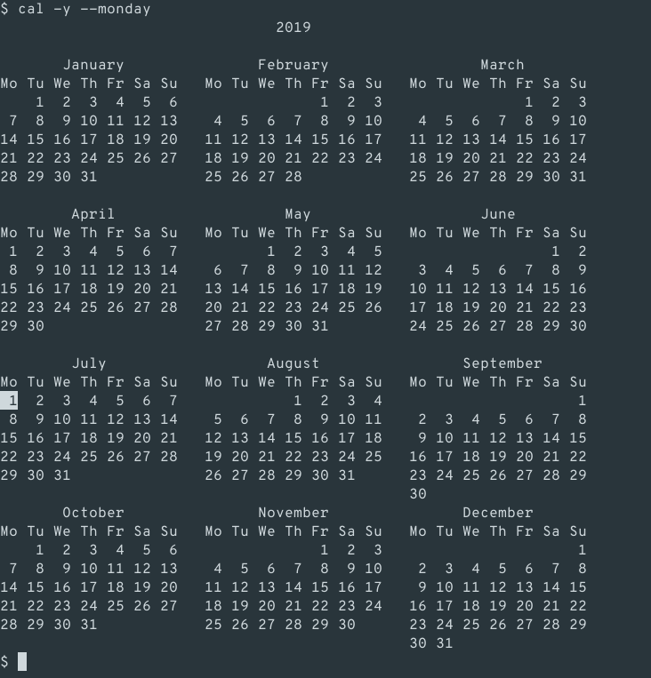
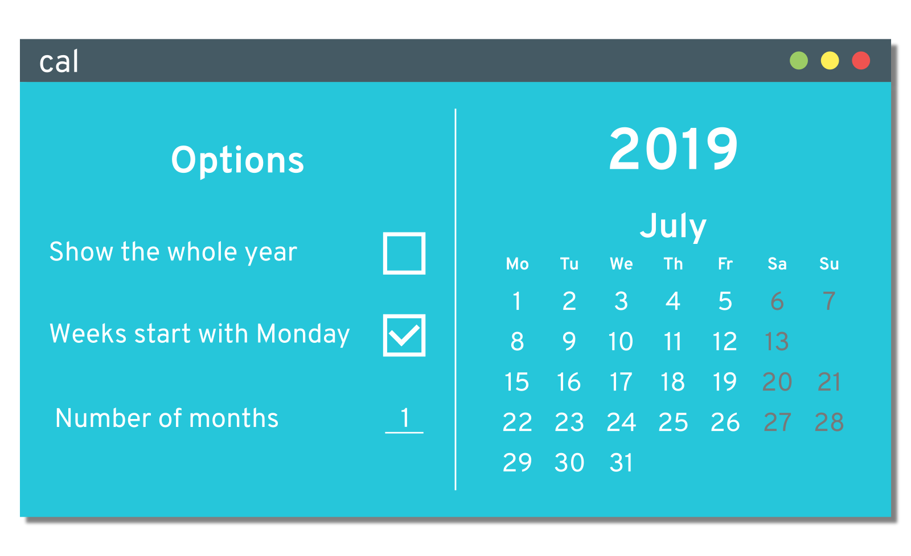
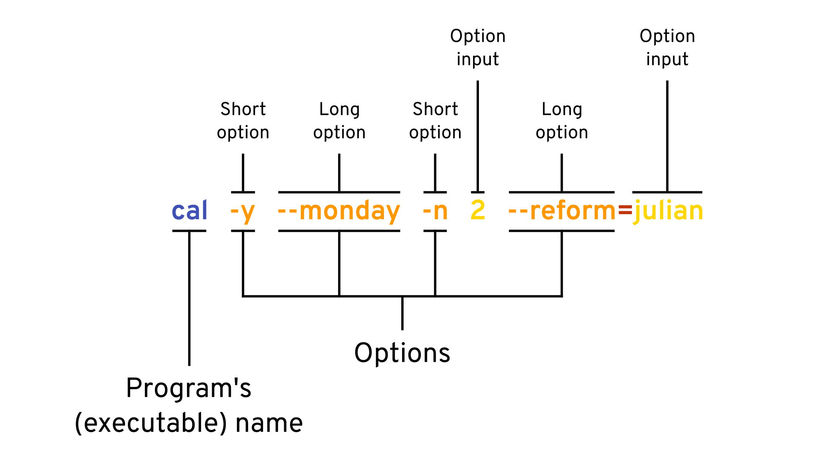
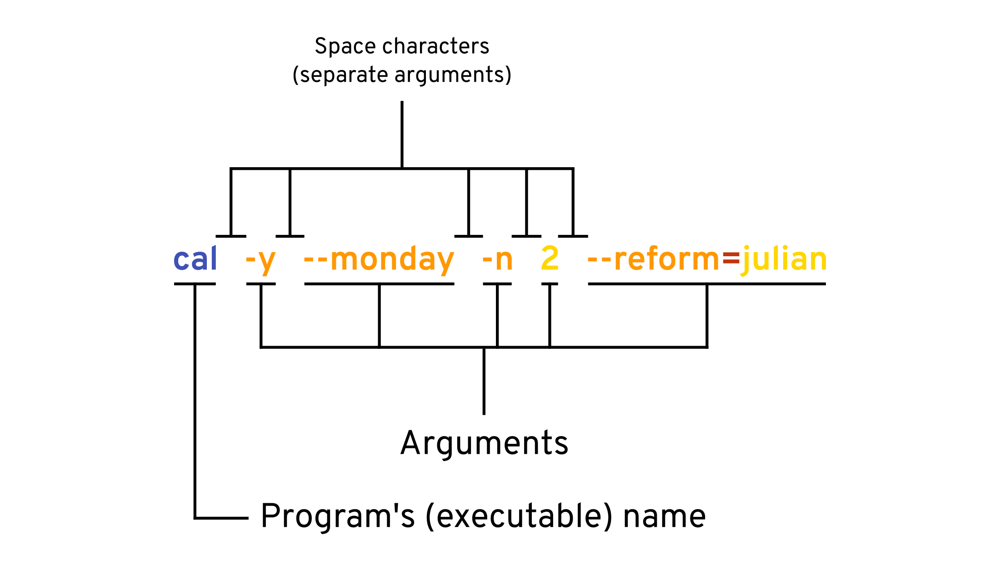

<p align="center">
    
    
</p>

<p align="center">
    <b><a style="text-decoration: none"
          href="#chapter-summary">Chapter Summary</a></b>
    &mdash;
    <b><a style="text-decoration: none"
          href="#chapter-quiz">Chapter Quiz</a></b>
</p>

**New concepts**: [graphical user interface](#term-gui), [command line
interface](#term-cli), [prompt](#term-prompt), [user input](#term-user_input),
[console output](#term-console_output).

<!-- Define link aliases (if any) here -->
[gnu-project]: https://www.gnu.org/gnu/thegnuproject.en.html

- - -

<!-- This is where you introduce what the chapter is about. -->
If you're new to Bash in specific and the command line in general, **welcome!**
In this very first chapter of **Linux Command Line Guide**, you'll get to know
about the command line environment, Shell, differences between Shell
interpreters, terminal emulator's shortcuts, and more. Let's begin!

> **Note**: Take a glance at the Table of Content and skip anything you've
previously learned about.

Table of Content
----------------

1. [Command line user interface](#command-line-user-interface)
2. [Command line efficiency](#command-line-efficiency)
    1. [Control and Speed](#control-and-speed)
    2. [System resources](#system-resources)
    3. [GUI's advantages over CLI](#guis-advantages-over-cli)
3. [Who use the command line interface?](#who-use-the-command-line-interface)
4. [How do I access a command line interface on my (graphical)
system?](#how-do-i-access-a-command-line-interface-on-my-graphical-system)
    - [On GNU/Linux](#on-gnulinux)
    - [On macOS](#on-macos)
5. [Pure command line interface](#pure-command-line-interface)
6. [Shell interpreter](#shell-interpreter)
7. [Different Shell implementations](#different-shell-implementations)

Command line user interface
---------------------------

Most computer users make use of <a name="term-gui">**graphical user interfaces**
</a>(abbreviated **_GUI_** or **_GUIs_** for plural) to control their machines.
That is, they control their computers by clicking/sliding icons, buttons,
sliders, etc. with mouse pointers. Of course, they do use keyboards, but not all
of the time. The screenshot below shows a graphical user interface that came
with Fedora Core 2 - an old release of the Fedora operating system that was
first released in 2004.

 <br />
**Figure 0.1** A screenshot of Fedora Core 2. This is a GUI because there are
graphical icons and a graphical mouse pointer.

<!-- This chunk of text is being considered for removal


In a graphical user interface, the visual design (i.e. UI/UX design) takes a
very important role in how the user understands and experiences. For example, if
a button on a web page that links to the site's Search page contains an icon of
a house (like the one on the left), the user will think that the button will
lead to the site's homepage. Visual design is the key in GUIs.

-->

GUI is suitable and enough for average computer users. However, if you want to
be more productive and efficient on the computer, you should know how to use a
<a name="term-cli">command line interface</a> (abbreviated **_CLI_**).

A command line interface is where the user controls a computer mainly by typing
commands. Creating files and folders, editing documents, connecting to a Wi-Fi
network, browsing the Web, etc. are all possible to do by typing commands and
not just by using a GUI. Typically, in a command line session, the user types a
command to draw an action, then waits for the action to be done, and then types
the next command. In general, a command line session has 3 distinctive
components: the <a name="term-prompt">**prompt**</a>, the
<a name="term-user_input">**user input**</a>, and the
<a name="term-console_output">**console output**</a>. They are shown in
**Figure 0.2**.

  
**Figure 0.2** Three distinct types of components in a command line session.

- The **prompt** is a piece of text that appears when the computer is ready for
the next command. It basically says that the user can now type the next command
(e.g. in the figure shown above, `[localhost] $ ` is the prompt).
- The **user input** is a command in the form of text typed in by the user to
specify what the user wants to do (e.g. in the figure shown above, the user
inputs include `cal`, `cd ~/.local/bin`, and `ls -w 60`).
- The **console output** (also called **terminal output**, **output**, or
**stdout**) is a visible chunk of text that is produced while the command is
running. The text can be log messages (such as warning messages or error
messages) or the result the user expected to see. For example, take a look at
**Figure 0.2** again. The first command typed by the user is `cal`. It is a
command used to see a calendar printed in the format typically used in printed
calendars. Indeed, the console output produced by `cal` showed a calendar with
the current date highlighted.

As said earlier, commands run one after another in a command line interface.
That means, after typing a command, the user will have to wait for that command
to finish running before he/she can issue the next command<sup><a
href="#footnote-1">[1]</a></sup>. To better understand what that means, see
**Figure 0.3**.

  
**Figure 0.3** A command line session. Here, it can be clearly seen that
command inputs are successive.

<a name="footnote-1"></a>
> **[1]**: Strictly speaking, this is not true for most CLIs that go with macOS
or GNU/Linux machines, because these are operating systems that can multi-task
(carry multiple tasks at the same time). You can technically start a process,
let it run in the background, and continue executing other commands without
waiting for the process started earlier to finish. There are also "terminal
multiplexers" which can give you a better image of different running processes.
But for now, let's not worry about those at the moment, and assume that CLIs
don't offer the ability to multitask like they traditionally did.

Command line efficiency
-----------------------

To be the most efficient on the computer, you need to use both the CLI and the
GUI reasonably. Some tasks are more quickly done in the CLI and some are more
quickly done in the GUI. Some are possible in the command line but not in the
GUI and vice versa.

### Control and Speed

The command line gives you more control than a GUI. Programs used in the command
line are often versatile and (as a result) complex, but since they don't get
displayed as graphical windows, the complexity is just hidden.

Imagine a universal file-finding program with many options (such as finding
executable files, finding files that are recently edited, finding files whose
names match a particular pattern, etc.). If such a program is available in the
command line, the computer user will have to spend time through a (possibly)
intimidating process of learning the program's options, but once that is done, the
user will just have to type the options needed every time he/she wants to use the
program. But if that program is available as a graphical application, either all
the options get visually displayed or they get grouped and hide into tool bars
and menus. Navigating through these is definitely more time-consuming.

In addition, there are low-level tools to work with your operating system and
they are only available in the command line. In fact, CLI is the predecessor of
GUI. CLI came first, and then there came GUI. Nowadays, many graphical programs
actually rely on text commands under the hood. A button on such a program is
tied to a specific command to carry out the intended instructions.

  
**Figure 0.4** GUI can be seen as the pretty layer on top of CLI. The graphical
interface that the users see is usually referred to as the "front-end", and the
underlying system is usually referred to as the "back-end".

The command line also introduces ways to repeat a task again and again that
would be otherwise impossible in a graphical environment.

### System resources

Using a GUI consumes more system resources than using a CLI. This is obvious,
since a graphical environment requires loading images, icons, fonts, videos and
other graphical components, which are heavier and more complex than just plain
text. No wonder why many graphical applications take a long time to load. In a
command line interface, lagging is something perhaps unbeknownst to many.

### GUI's advantages over CLI

Some tasks are more quickly done in the GUI. A graphical button may be tied with
multiple commands. Clicking such a button gets the work done faster than
manually typing the commands. For example, if you want to safely eject a USB
device from your computer, you will only have to click one button<sup><a
href="#footnote-2">[2]</a></sup>. But if you want to eject it by typing
commands, 3 commands (or even more) will have to be issued:

```shell
lsblk                # Find the mount point of the mounted partition in the USB device
umount /dev/sdb1     # Un-mount the partition
sudo eject /dev/sdb  # Eject the USB device, requires typing user password
```

> **Note**: Please do not worry about learning the commands above at the moment.

There are also tasks that are possible in the GUI but not in the CLI, such as
image editing or video editing<sup><a href="#footnote-3">[3]</a></sup>.

<a name="footnote-2"></a>
> **[2]**: At least that's true if you are using the GNOME desktop environment.

<a name="footnote-3"></a>
> **[3]**: Strictly speaking, that's possible but not to a great extent. Not
even to a _good_ extent. It's obvious that no image editor uses the CLI for much
of their work.

Who use the command line interface?
-----------------------------------

- **Computer programmers**: They develop applications and need to sort out their
ideas in a command line environment first before putting a pretty layer - the
graphical interface - on top. Programmers also use lots of command line programs
for speed and productivity.
- **Back-end developers**: They work on the inner-working components, not the
outer layer that is intended to be visually nice, so they work in CLI a lot.
- **Website/Server maintainers**: Website and server maintenance is done much
faster in the CLI.
- **Computer scientists**: When they want to test their new ideas such as
algorithms or ways to optimize an operating system, text commands are usually
their preferred way.
- **Supercomputer operators**: GUI is not featured in supercomputers in order
for these behemoths to work to their fullest extends. Managing a supercomputer
is also more quickly done in CLI.
- **Retro computing hobbyists**: Retro computers (i.e. old computers, made in
the 20<sup>th</sup> century) don't have GUI.
- **A small portion of non-technicians**: They just want to play around with the
text commands or get things done quickly.
- ~~Gormless kids who try to look like hackers~~
- ...and more

How do I access a command line interface on my (graphical) system?
------------------------------------------------------------------

On any graphical system that is either GNU/Linux or macOS, there should be a
program that ships with the system that lets its users use a command line. This
program is called **terminal emulator**. The reason why it is called an
"emulator" is because the interface introduced by such a program is not actually
CLI; you can change its font, its background color, etc. yet these attributes
are tied to GUI (see **Figure 0.5**).

  
**Figure 0.5** 2 terminal emulator windows opened, each with a different look.

Terminal emulators come in handy and useful, providing that you need both GUI
and CLI to maximize your productivity. In this section, we provide instructions
on how to open a terminal emulator in GNU/Linux and also in macOS.

### On GNU/Linux

If you use GNU/Linux, the terminal emulator ships with your desktop environment.
For instance, if you're using GNOME - the most widely used Linux desktop
environment - then a terminal emulator called _GNOME Terminal_ (as seen in
**Figure 0.6**) should have already been provided as a software component of
GNOME, and you can search for it like how you search other applications on your
computer.

  
**Figure 0.6** A GNOME Terminal window, as seen in the GNOME desktop
environment.

In KDE (another desktop environment), the terminal emulator _Konsole_ is
provided as part of the desktop environment itself. In LXDE, the terminal
emulator is called _LXTerminal_.

In Ubuntu (arguably the most popular Linux distribution), you can use the
keyboard shortcut `Ctrl` + `Alt` + `T` to open a terminal emulator.

  
**Figure 0.7** An XFCE4 Terminal window, as seen in the XFCE desktop
environment.

Perhaps in any desktop environment, you can just search for "terminal".

### On macOS

The terminal emulator that ships with macOS is called _Terminal_. Try searching
for it and open it.

<p align="center">
    
</p>

**Figure 0.8** A macOS Terminal window.

Pure command line interface
---------------------------

Terminal emulators do their job well, but advanced users and tech-savvy people
doing certain jobs sometimes have to use pure CLI because they want to use even
less hardware resources. In a pure command line environment, the desktop
environment does not run, thus less hardware resources are needed.


**Figure 0.9** A TTY (as shown in Preamble).

In the UNIX world, pure command line is called **terminal** (as you might have
guessed) or **tty**. To access a tty, try the keyboard combination `Ctrl` +
`Alt` + `F1`. But, there are a few things to watch out:
- A GNU/Linux distribution might offer multiple ttys, called `tty1`, `tty2`,
`tty3`, and so on. The keyboard combination `Ctrl` + `Alt` + `F1` is used to
open `tty1`, `Ctrl` + `Alt` + `F2` is used to open `tty2`, and so on.
- Depends on the system you are running, some ttys might be replaced with
graphical displays. For example, in Ubuntu 17.04 and earlier releases of Ubuntu,
`tty1`, `tty2`, `tty3`, ..., `tty6` are ttys, and `tty7` (can be opened by
`Ctrl` + `Alt` + `F7`) is actually the primary graphical environment. In Ubuntu
17.10 and later releases, pure command line ttys are available from `tty3` to
`tty7`. As for my Fedora Workstation 30 system, command line ttys are available
from `tty3` to `tty6`, and `tty2` is the graphical environment.
- If you switch to a tty from a graphical environment, the graphical environment
will still be running (and consume hardware resources). You'll have to manually
disable it (if you want less hardware resources consumption).

> **Note**: It is recommended that you use a terminal emulator to practice using
the Linux command line throughout the guide instead of a tty.

Shell interpreter
-----------------

There's a big program that works under the text commands that you see. In the
UNIX world, this program is commonly known as the **Shell interpreter**, or just
**shell**. Its job is to read and process the commands typed in and execute
those commands. In addition, a Shell interpreter can be thought of as something
similar to an interpreted programming language interpreter (e.g. Python
interpreter) that can read and execute text files containing valid commands,
called **Shell scripts**.

If you are still having troubles understanding what it is, let's think
analogously. Python is a programming language, Python commands are read by a
Python interpreter, and there are Python shells, like IPython, to type Python
commands interactively, indeed? In a similar fashion, Shell is a _scripting_
language, Shell commands are read by a Shell interpreter, and the language also
has Shell shells (which are actually terminals and terminal emulators) where you
can type Shell commands interactively.

Different Shell implementations
-------------------------------

A programming language may have dialects (e.g. Python is a programming language,
its dialects include CPython, PyPy, and Stackless Python). Similarly, Shell has
various dialects. These dialects are quite similar at the ground level, but they
do differ in many ways. The following table lists common Shell dialects.

|      Name        |Abbreviation<br/>(or executable name)|Description|
|      :---:       |                :---:                |:---|
|   Bourne shell   |                `sh`                 |Ancestor of modern Shell interpreters, standardized.|
|Bourne-again shell|               `bash`                |A very widely used Shell interpreter, especially in GNU/Linux systems, developed as part of [The GNU Project.][gnu-project]|
|     C Shell      |                `csh`                |A Shell dialect with syntax similar to that of the C programming language.|
|       tcsh       |               `tcsh`                |An improved version of C Shell.|
|     Z Shell      |                `zsh`                |An improved version of Bourne-again shell.|

Of all the shells, **Bash** (Bourne-again shell) is the most popular. Our Linux
Command Line Guide aims to teach Bash and not the other shells for the following
reasons:

1. Bash is the most popular of all shells
2. Many other shells are compatible with it (i.e. Bash commands can be executed
by those shells)
3. Bash is not just available on most GNU/Linux systems, but also macOS, and,
yes, Windows (via Windows Subsystem for Linux)

Thus, if you want to proceed further in the guide, you should use Bash or any
shell that is compatible with it (e.g. you may use the increasingly-popular
Z Shell).

Command line programs
---------------------

Programs installed on your computer include graphical programs (e.g. your Web
browser, your To-do app, your file browser) and command line programs. Command
line programs are those that are only accessible in the command line, so if
you've never used the command line, you've never used a command line
program<a href="#footnote-4"><sup>[4]</sup></a>.

<a name="footnote-4"></a>
> **[4]**: At least not directly. Recall that graphical programs may make use of
command line programs.

Every text command employs a command line program. There are 2 types of command
line programs, they are **Shell built-in commands** and **external programs**.
Shell built-in commands are the programs that are contained within the Shell
interpreter itself. External programs are not (e.g. those that are installed on
your computer's disk drive).

> **Note**: You can see all of your Shell built-in commands (along with their
overall usage) by typing "`help`" and then hitting Enter in the command line.
The output may contain a lot of text and look like it's scrambled.

A closer look at individual commands
------------------------------------

### The basics

As we learned earlier, each text command starts a program that does what the
user wants to do. Thus when typing a text command, the user has to type the name
of the program's executable file.

> **Note**: In Microsoft Windows, executable files have the ".EXE" suffix, or
file extension. In UNIX-like operating systems (e.g. macOS), most executable
files don't have file extensions.

For this section, please open a terminal emulator window and follow along. Now,
let's say you want to see a calendar. You probably have a graphical calendar
application, probably ships with your desktop environment (e.g. GNOME Calendar
or KOrganizer). But you can view a text calendar in the command line too! This
is handy when you're working in CLI and you don't want to leave your environment
just to quickly see a calendar.

1. With a terminal emulator window opened, type "cal".

```shell
cal
```

2. Hit the Enter key on your keyboard to execute this command. A calendar is
displayed. Look how cool it is! A calendar made of text characters and spaces!



You may feel unfamiliar with this calendar at first, but you will soon realize
that it looks quite the same as ordinary calendars.

> **Note**: Your command prompt may look different from the one shown in the
image above. In the image above, the command prompt is "$ " (a dollar sign
followed by a space). This is not an issue. You will eventually learn how to
change the command prompt.

What you just did is running the `cal` program, which is a calendar program
available in the command line ("cal" is short for "calendar").

Graphical calendar applications typically offer options and preferences such as
the option to view the whole year (and not just the current month), the option
to set Sunday as the first day of the week, etc. How do you do the same in the
command line? Fortunately, the `cal` program offers many additional options to
show you what you want, and to use those options, you have to type a little bit
more.

3. Let's say you want to view the whole year and not just the current month.
Again, type "cal", but don't hit Enter yet.

4. Type " -y" (a space, followed by a hyphen, followed by the lowercase letter
_y_). Your command should now be like this:

```shell
cal -y
```

5. Hit Enter. You should now see a calendar for the whole year displayed by
`cal`.



This is exactly how you can choose options to modify command line programs'
default behaviors. Just type the option's name out, separately from the
program's name (i.e. typing "cal-y" does not work because your Shell
interpreter will think that you are trying to use a program named `cal-y`).

6. You can type multiple options and not just one. Let's make `cal` show the
whole year with Monday as first day of week. Type "cal -y".

```shell
cal -y
```

7. Now type " --monday" (a space, followed by 2 hyphens, followed by the word
_monday_). Your command should now look like this:

```shell
cal -y --monday
```

8. Hit Enter.



Can you see the difference? `cal` now shows the whole year just like last time,
but now Monday is the first day of every week!

9. Now, let's make `cal` display only 2 months instead of the whole year or just
the current month. `cal` always displays the current month, so when asked to
show 2 months, `cal` shows the current month and the next month. First, type
`cal --monday`. We still need Monday to be displayed as first day of week.

10. Type " -n 2" (a space, followed by a hyphen, followed by the lowercase
letter _n_, followed by another space, followed by the number _2_).

```shell
cal --monday -n 2
```

You may have noticed that there's something different here. This time, you have
to type 2 space characters. It looks like we're specifying 2 options, `-n` and
`2`, but this is not the case. `-n` is still an option, like `-y` and
`--monday`. But `2` is not an option. It is the _**input for the option `-n`**_.
In particular, `-n` is the option to specify the number of months to be
displayed by `cal`, and clearly it needs an input, so we've specified `2` as the
input for this option.

Some options don't need inputs, some options do. Think of these as check boxes
and value fields in graphical applications. Options that don't require inputs
are like the check boxes, options that do are like the text fields, as
illustrated in **Figure 0.10**.

  
**Figure 0.10** Like graphical programs, command line programs also have options
and preferences. Some require inputs (like the "Number of months" option above),
some don't (like the "Show the whole year" option above).

A command line program may have options that do the same job, and `cal` is such
a program. The `-n` option that we just covered has another option that does the
same job, which is `--months`. Again, it does exactly the same job as the `-n`
option, the only difference is that `--months` is longer to type. This makes the
option look redundant, but it's easier to be recalled.

`cal` has another interesting option which is `--reform`. It requires an input
(just like the `-n` option does). Basically, this option lets you choose which
calendar reform to be used.

11. Type "cal -y --monday -n 2". Don't hit Enter yet. These options tell `cal`
to show the whole year, use Monday as the first day of every week, and display
2 months, respectively.

```shell
cal -y --monday -n 2
```

12. Type " --reform=julian" (a space, followed by 2 hyphens, followed by the
word _reform_, followed by an equal sign, followed by the word _julian_). This
makes `cal` use the Julian reform because we've specified `julian` to be the
input for the option `--reform`. Hit Enter to run the command.

```shell
cal -y --monday -n 2 --reform=julian
```

You may have noticed that there's a difference in specifying the input for our
new option here. This time, you have to type an equal sign, not a space like how
you did with the `-n` option (`-n 2`).

### Looking into smaller details

Let us consider this command:

```shell
cal -y --monday -n 2 --reform=julian
```

The space characters in between the words are crucial, so that the command will
not misinterpret your intentions. If we separate the command into parts
according to the space characters, we get 6 parts:
1. `cal`: The name of the program we want to use, which must always go first in
a text command
2. `-y`: An option that does not require an input
3. `--monday`: Another option that does not require an input
4. `-n`: An option that requires an input
5. `2`: The input to the option that precedes it, which is `-n`
6. `--reform=julian`: An option (`--reform`) and its input (`julian`). This
relationship is set by the equal sign (`=`).

Notice that each of the options has at least one leading hyphen (`-`). This is
a well known standard in the world of Linux command line. In particular, there
are 2 types of options:
- **Short options**: These are options that start with one hyphen followed by a
single character. `-n`, `-c`, `-J`, `-v` are examples of short options.
- **Long options**: These are options that start with two hyphens followed by
2 or more characters, which form one or more words. If there are many words,
they are separated by hyphens (and not space characters). `--reform`, `--all`,
`--color`, `--show-all`, `--names-only` are examples of long options.

The following table gives more details regarding the differences between these
2 types of options.

|                    |  Short option  |              Long option               |
|        :--:        |      ---       |                  ---                   |
|Number of leading hyphens|     1     |                   2                    |
|        Name        |Single character|One or more words separated by hyphens  |
|Input declaration (if an input is required)|` ` (space)|`=` (equal sign)      |
|      Examples      |`-v`, `-c`, `-b`|`--all`, `--update`, `--match-case`     |
|Examples with inputs|`-n 3`, `-i ignore`, `-s ","`|`--color=always`, `--num=9`|

> **Note**: Most command line programs follow this standard, but not all. Thus
before using a command line program, it is best to read its documentation first.

  
**Figure 0.11** Different parts of a text command.

Earlier we divided a command into 6 "parts", including the program's name.
Generally speaking, any "part" that follows the program's name is called an
**argument** to that program. For instance, the command we divided earlier has
5 arguments. They are: `-y`, `--monday`, `-n`, `2`, and `--reform=julian`. Think
of the arguments of a program as inputs to that program. Arguments are often
options and options' inputs, but they don't always have to be (as we shall see
later).



### Shorthands

Many command line programs (especially the built-ins) offer shorthands to type
out options faster. These shorthands work in general.

For this section, you'll use a different command line program, called `uname`.
`uname` is used to print various system information. This includes the kernel
name, the operating system, the processor type.

1. Open a terminal emulator window (if necessary).
2. Type "uname". Again, the name of the program you wish to use must always be
typed first.

```shell
uname
```

3. Hit Enter. By default, `uname` prints the name of the kernel you are using
(e.g. if you're using Linux, the output should be "Linux").
4. Like `cal` and countless other command line programs, `uname` offers options.
Use the `-s` and `-r` options to print the kernel name along with its release
name.

```shell
uname -s -r
```

5. There is an established shorthand for multiple short options, allowing these
to be specified in just one argument instead of many. Using this shorthand, the
leading hyphen in every option (except for the first one) is absent, and the
space characters between them are also absent. In this sense, the previous
command can be shortened to:

```shell
uname -sr
```

6. Now we'll use `uname` to print the kernel name, the kernel's realease name,
and the processor type. This requires using the `-s`, `-r`, and `-p` options,
respectively. Instead of typing `uname -s -r -p`, try to apply the shorthand
you just learned.

```shell
uname -srp
```

This shorthand can be used for as many short options as there are.

Another shorthand also exists for specifying inputs. In particular, for short
options that require inputs, the space characters between the options and the
inputs can be omitted. Thus, this command:

```shell
cal -n 2
```

is the same as this command:

```shell
cal -n2
```

The two shorthands that we've learned can be used together in a single command,
providing that after an input used in a shorthand, there's no single option that
directly follows it (i.e. without a space character). Observe that this command
is valid:

```shell
cal -mn2
```

but this is not:

```shell
cal -n2m
```

The above command is invalid because `2m` is thought to be the input for the
option `-n`, thus making it an invalid input, since the `-n` option requires a
whole number.

Chapter Summary
---------------

Chapter Quiz
------------
